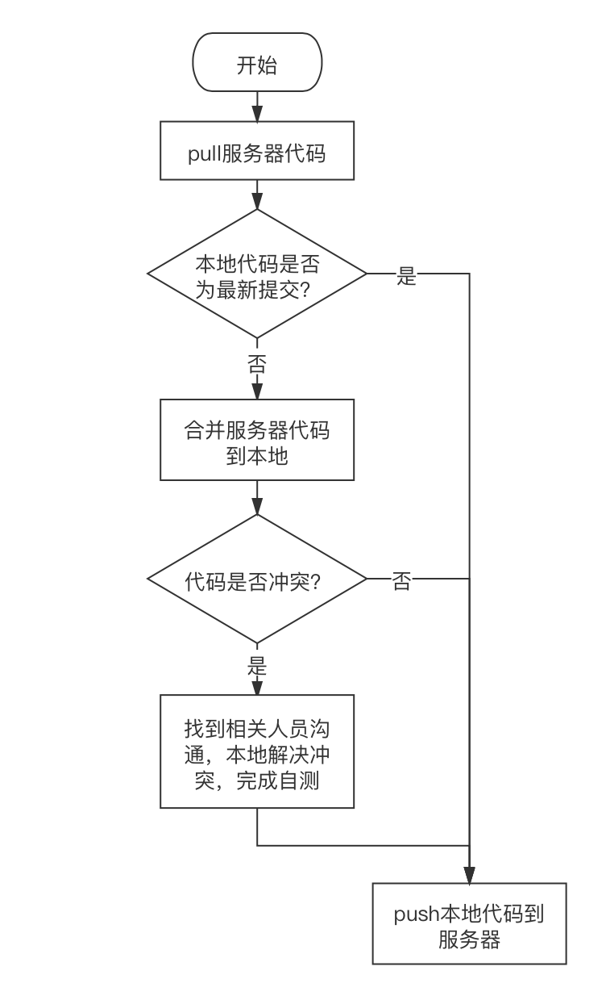

## 文档修订记录
| 序号 |  修改时间  | 修改人 |  版本  |     备注     |
|:----:|:----------:|:------:|:------:|:------------:|
|  1   | 2020.09.30 |  刘刚  | V1.0.0 |     初稿     |
|  2   | 2020.10.12 |  刘刚  | V2.0.0 | 迭代分支管理 |

## 一、概述
* Git 作为一个源码管理系统，不可避免涉及到多人协作。协作必须有一个规范的工作流程，让大家有效地合作，使得项目井井有条地发展下去。“工作流程”在英语里叫做"workflow"或者"flow"。
* 常见的三种工作流程：Git flow、GitHub flow、GitLab flow。三者各有优缺点，以及应用的场景。因为我们研发项目的一些特殊情况，基于三种工作流程做了一些调整，下面结合我们的研发项目情况具体说明。

## 二、标准版迭代分支规范
* 每个迭代都有属于自己的主分支，分支名称与迭代名称对应，加上前缀“v”。
* 如果迭代完成进行封版，则在该迭代分支上打上Tag，Tag名称与迭代名称一致。
* 若释放某迭代源码，则释放该迭代对应的分支。
* 临时分支（如功能分支、修复分支、本地分支等），仍然按照之前的方式使用。修改在临时分支进行，测试无误后，再合并到主分支。要确保迭代主分支是完好无损的。
* 提交记录要清晰，合并代码需谨慎。（提交规则见“代码提交规则”小节）

|  迭代名称   |   分支名称   |   Tag名称   |
|:-----------:|:------------:|:-----------:|
| 3.3.02.1000 | v3.3.02.1000 | 3.3.02.1000 |

### 下面根据标准版的三个迭代进行示例说明

* 3.3.02.1000迭代（v3.3.02.1000分支），已封版，有bug在修改。
* 3.3.03.1000迭代（v3.3.03.1000分支），测试中，有bug在修改。
* 3.3.04.1000迭代，即将进入开发，需要创建迭代主分支（v3.3.04.1000）。

1）示例一：3.3.04.1000迭代创建主分支
操作：基于v3.3.03.1000分支创建v3.3.04.1000分支。（即基于当前最新版本创建下一个迭代主分支）

2）示例二：3.3.03.1000迭代封版
操作：v3.3.03.1000分支当前最后一条提交记录，打上Tag 3.3.03.1000。（Tag打了不许擅自修改）

3）示例三：3.3.03.1000迭代封版后，bug仍然在修改
操作：bug修改后代码提交到v3.3.03.1000分支。（通过Tag可以判断哪些问题是封版后发现处理）

4）示例四：释放3.3.03.1000源码
操作：把v3.3.03.1000代码释放即可，不需要考虑Tag。（即释放某迭代主分支最新代码）

5）示例五：3.3.03.1000中修复了一个bug，该bug同样存在于3.3.02.1000和3.3.04.1000中，需要回归
操作：需要把v3.3.03.1000的某些代码回归到v3.3.02.1000和v3.3.04.1000中，可以使用merge、cherry-pick，或者code的形式进行回归，具体情况具体分析。

注：我们通过一个demo进行了演练，大家可以看看xx-mhealth3.2/04-09-开发规范/git规范.mp4。在实际过程中如果遇到问题，随时可以发出来大家一起讨论。

## 三、常用Git命令

* pull：拉取
* push：推送
* add：添加
* commit：提交
* stash：暂存
* merge：合并
* rebase：衍合
* cherry-pick：遴选

## 四、代码提交规则

 ### 提交的说明包括两部分，动作类型：简要说明，以中文的“：”进行区分。

|   动作   |                                 说明                                 |                    示例                     |
|:--------:|:--------------------------------------------------------------------:|:-------------------------------------------:|
|   ADD    |                           新增功能、文件等                           |          ADD：满意度调查，统计功能          |
|   DEL    |                           删除功能、文件等                           | DEL：xxx监测LollypopSDK.framework及相关引用 |
|   MOD    |                               修改功能                               |          MOD：满意度调查，统计详情          |
|   FIX    |                修复问题。如果是禅道bug，需注明bug编号                |    FIX：#60027，专科随访患者管理布局错乱    |
|  MERGE   |              合并代码，自动合并时一般不需要修改说明文字              |          ADD：满意度调查，统计功能          |
| REFACTOR | 代码重构，需注明重构模块，及说明。一般重构需要使用新的独立分支处理。 |     REFACTOR：预约挂号，mintUI改vantUI      |

## 五、代码提交流程

注意点：
1、先pull，再push
2、冲突在本地解决

## 六、工作流程
* 1、每天早上开始工作前，请先拉取服务器代码，并编译，检查服务器代码是否有错误。检查无误后即可开始自己的工作。如果有误，请通知最后的代码提交者及项目负责人。
* 2、理论上每修改一个完整的功能点都可以提交代码并推送至服务器。
* 3、每天工作结束后或者下班前，请提交本地代码，并推送至服务器。

## 七、 参考资料

[Git 工作流程](https://www.ruanyifeng.com/blog/2015/12/git-workflow.html)

[一篇文章搞定Git——Git代码管理及使用规范](https://blog.csdn.net/weixin_42092278/article/details/90448721)

[git规范](SVN | xx-mhealth3.2/04-09-开发规范/git规范.mp4)
