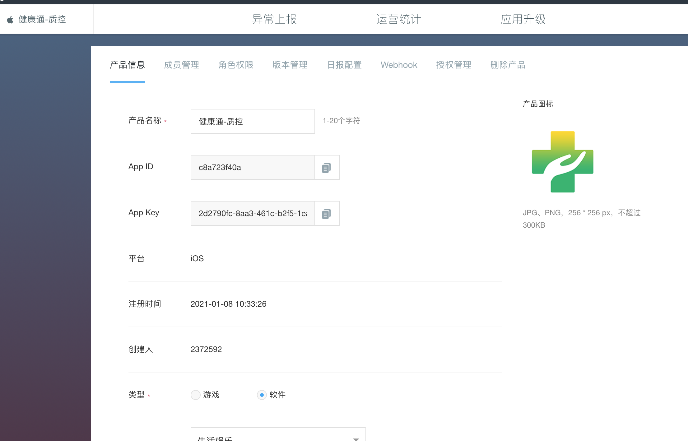

## Bugly账号注册

1、按照官方文档注册登录
2、新建产品，注册基本信息


## BuglyHotfix接入 （文档https://bugly.qq.com/docs/user-guide/instruction-manual-ios-hotfix/）
1、BuglyHotfix提供两种集成方式供iOS开发者选择：
  1.1通过CocoaPods集成
  在工程的Podfile里面添加以下代码：
  ```ruby
  pod 'BuglyHotfix'
  ```
  BuglyHotfix 已经包含了 Bugly 的所有能力，所以只需去掉 Bugly.framework 即可；
  保存并执行pod install,然后用后缀为.xcworkspace的文件打开工程.
  1.2、JSPatch 集成
下载 JSPatch 或 直接使用 BuglyHotfix SDK 压缩包内的 JSPatch 版本
把下列文件拖入 Xcode 工程内(请勾选Copy items if needed选项)
JPEngine.h
JPEngine.m
JSPatch.js
1.3、导入头文件
在工程的AppDelegate.m文件导入头文件
#import <BuglyHotfix/Bugly.h>
#import <BuglyHotfix/BuglyMender.h>
#import "JPEngine.h"
2、然后在AppDelegate中初始化
在工程的AppDelegate.m文件导入头文件
```ruby
#import <Bugly/Bugly.h>
- (BOOL)application:(UIApplication *)application didFinishLaunchingWithOptions:(NSDictionary *)launchOptions {
//初始化 Bugly 异常上报
    BuglyConfig *config = [[BuglyConfig alloc] init];
    config.delegate = self;
    config.blockMonitorTimeout = 2;
    config.consolelogEnable = YES;
    config.blockMonitorEnable = YES;
    config.reportLogLevel = BuglyLogLevelWarn;
    [Bugly startWithAppId:@"c8a723f40a"
        developmentDevice:YES
                   config:config];

    //捕获 JSPatch 异常并上报
    [JPEngine handleException:^(NSString *msg) {
        NSException *jspatchException = [NSException exceptionWithName:@"Hotfix Exception" reason:msg userInfo:nil];
        [Bugly reportException:jspatchException];
    }];
    //检测补丁策略
    [[BuglyMender sharedMender] checkRemoteConfigWithEventHandler:^(BuglyHotfixEvent event, NSDictionary *patchInfo) {
        //有新补丁或本地补丁状态正常
        if (event == BuglyHotfixEventPatchValid || event == BuglyHotfixEventNewPatch) {
            //获取本地补丁路径
            NSString *patchDirectory = [[BuglyMender sharedMender] patchDirectory];
            if (patchDirectory) {
                //指定执行的 js 脚本文件名
                NSString *patchFileName = @"main.js";
                NSString *patchFile = [patchDirectory stringByAppendingPathComponent:patchFileName];
                //执行补丁加载并上报激活状态
                if ([[NSFileManager defaultManager] fileExistsAtPath:patchFile] &&
                    [JPEngine evaluateScriptWithPath:patchFile] != nil) {
                    BLYLogInfo(@"evaluateScript success");
                    [[BuglyMender sharedMender] reportPatchStatus:BuglyHotfixPatchStatusActiveSucess];
                }else {
                    BLYLogInfo(@"evaluateScript failed");
                    [[BuglyMender sharedMender] reportPatchStatus:BuglyHotfixPatchStatusActiveFail];
                }
            }
        }
    }];
}
```
3.1写补丁，需要一点JS基础，但会声明变量、调用方法，就可以使用大部分功能了，好在JSPatch作者为我们开发了一款插件，可以使用XCode补全JS代码。
https://github.com/bang590/JSPatchX
3.2、在我们刚才的demo中新建一个empty文件，叫main.js，这是JSPatch规定的js文件命名
3.3 发布补丁

补充
一、可能很多人都不会写js补丁，好在JSPatch作者还为我们准备了另一个工具。
http://bang590.github.io/JSPatchConvertor/
