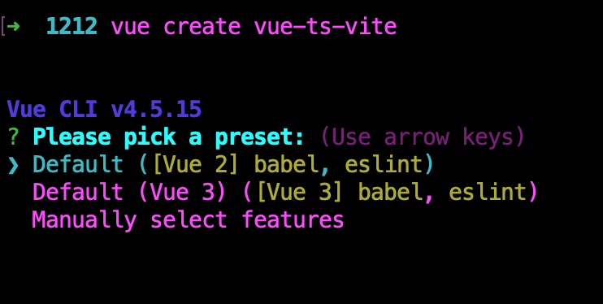
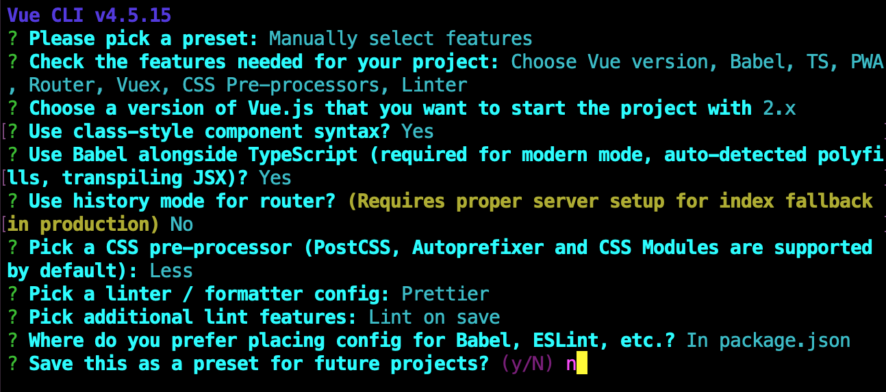
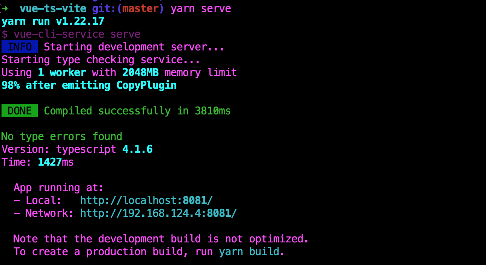
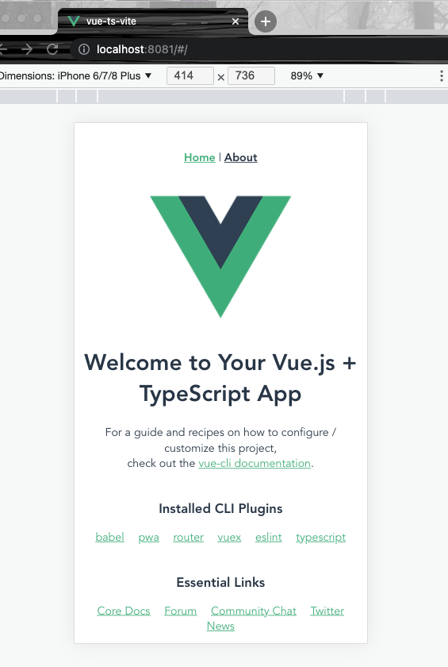
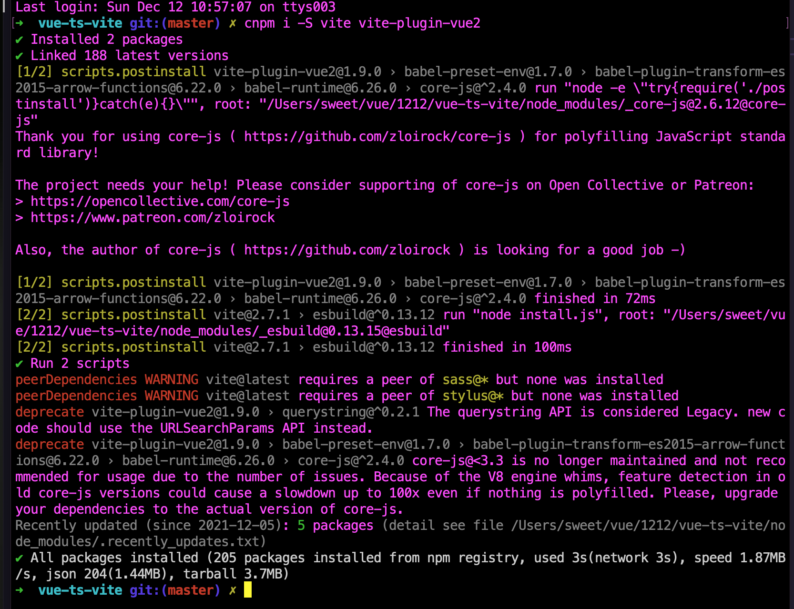
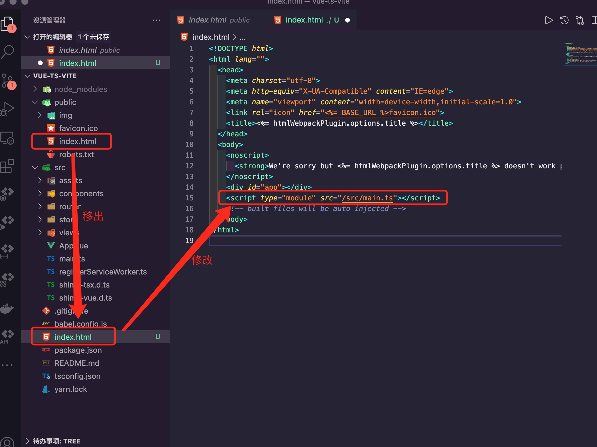
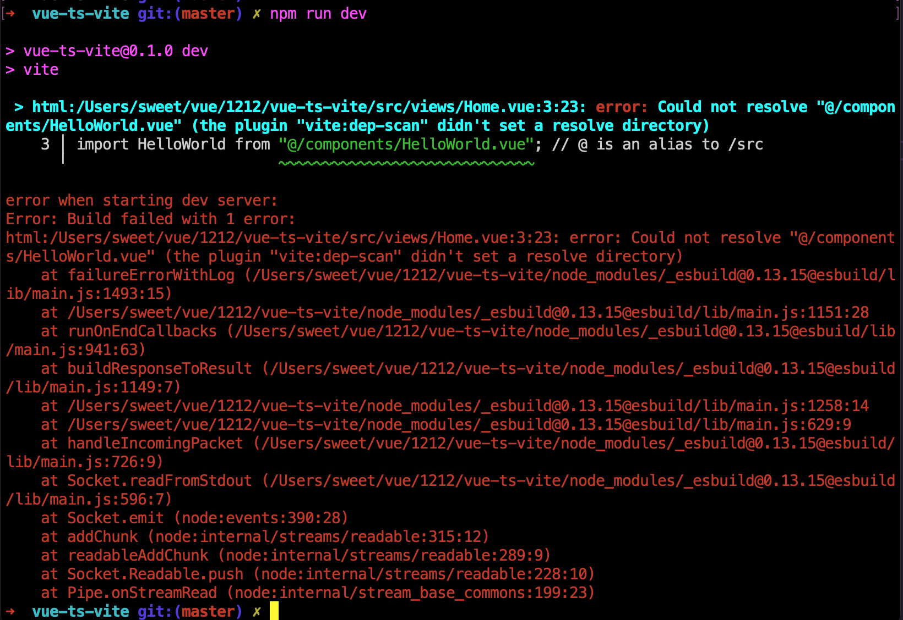
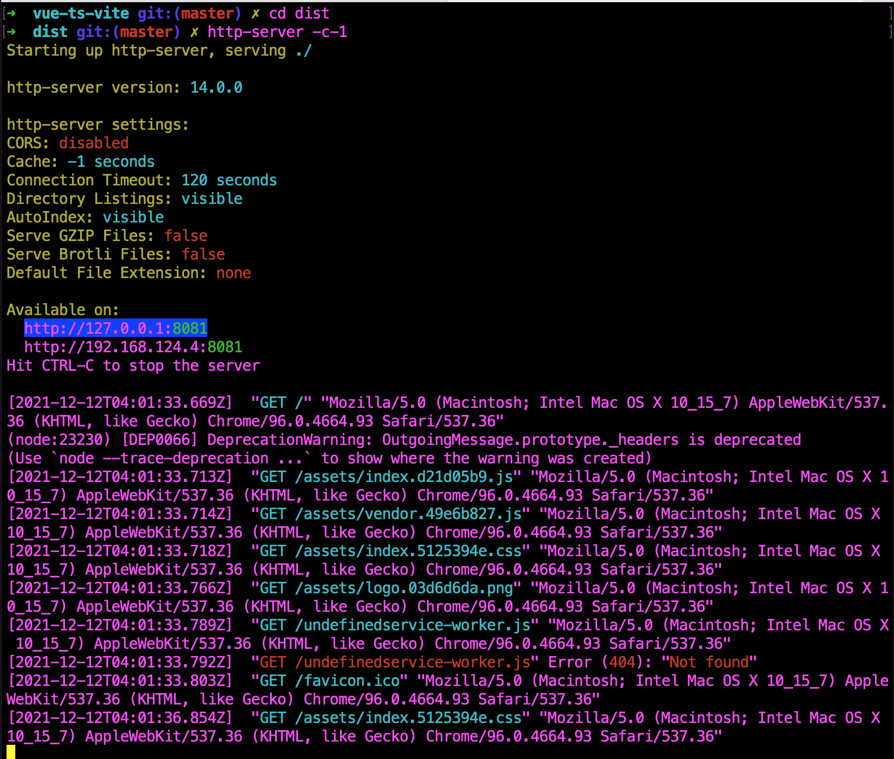
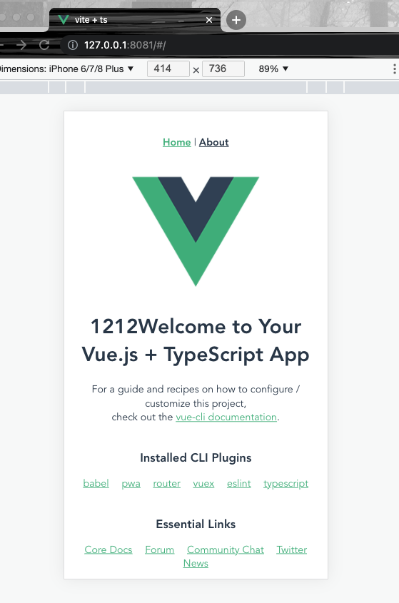

<Boxx  changeTime="5000"/>  

## 总方针：是什么？从哪里来？要到哪里去？

[ 注意: 下面的说明仅供参考,会由于项目变更而发生变化,请随时保持沟通! ]()

[gitlab - 源码](https://github.com/liugangtaotie/vite-principle-code)

### 一、是什么

有关vite是什么，请移步我的另一篇文章  [vite](/word/vite.html)；

### 二、从哪里来

Vite 的前身是 [https://github.com/vuejs/vue-dev-server](https://github.com/vuejs/vue-dev-server) - 这个概念从一开始就是在服务器端对原生 ESM 请求进行按需编译。Vite 0.x 开始开发的时候是 2020 年 4 月（Commits · vitejs/vite），这个时候的开发目标已经是基于 ESM 实现 HMR 热更新。

有关vite多久能干掉webpack的问题，请查看[vite多久能干掉webpack的问题？](https://www.zhihu.com/question/477139054/answer/2156019180?utm_source=wechat_timeline&utm_medium=social&utm_oi=989873592787734528)，里面尤大大解释的非常清晰，建议大家好好品味，😁  ！！！


### 三、要到哪里去

当然要到我们的碗里来，😁

来吧，接住，以下就是将vue-cli搭建的ts+webpack改装成ts+vite的整个过程：

第一步：创建一个项目：vue create vue-ts-vite


第二步：按需选择自己的配置项，我这边选择手动挡（manually select features）


第三步：选择一些额外参数，vue2 + babel +ts + pwa + router + vuex + css + linter


第四步：安装相关依赖


第五步：执行yarn serve


第六步：在浏览器上查看（localhost:8080）, 如果有差别，请根据实际情况调整端口号



第七步：开始改造成vite版本，安装相关依赖 cnpm i -S vite vite-plugin-vue2


第八步：将public下面的index.html移动到根目录，同时在`<div id="app"></div>`下面加入：`<script type="module" src="/src/main.ts"></script>`,因为vite入口地址是从index.html开始的


第九步：加入vite.config.ts文件，内容为

``` ts
import { defineConfig } from 'vite'
import { createVuePlugin } from 'vite-plugin-vue2'

export default defineConfig({
  plugins: [createVuePlugin()],
})
```


第十步：package.json的script加入

``` ts
...
  "dev": "vite",
  "build:vite": "vite build",
...
```


第十一步：执行npm run dev，将会出现如下报错


第十二步：找到对应错误信息点为index.html里面link图标地址有问题，需要改为

``` html
...
<link rel="icon" href="/favicon.ico" />
<title>vite + ts</title>
...
```


第十三步：再次执行npm run dev, 又出现如下错误，大致问题是没有配置别名


第十四步：再对vite.config.ts进行改造
``` ts
import path, { resolve } from 'path'
import { defineConfig } from 'vite'
import { createVuePlugin } from 'vite-plugin-vue2'

export default defineConfig({
  plugins: [createVuePlugin()],

  // 配置别名
  resolve: {
    alias: [
      {
        find: /^~/,
        replacement: '',
      },
      {
        find: '@',
        replacement: resolve(__dirname, 'src'),
      },
      {
        find: '@API',
        replacement: resolve(__dirname, 'src/api'),
      },
      {
        find: '@ASS',
        replacement: resolve(__dirname, 'src/assets'),
      },
      {
        find: '@COM',
        replacement: resolve(__dirname, 'src/components'),
      },
      {
        find: '@VIE',
        replacement: resolve(__dirname, 'src/views'),
      },
    ],
  },
})
```


第十五步：再执行npm run dev 发现项目正常run 了，默认端口号为`localhost:3000`


第十六步：为了确保是正常的逻辑，修改一下相关字段


第十七步：保存后，目标地址也进行相应的修改


第十八步：现模拟部署到远端服务器，执行npm run build:vite，生成相关dist文件


第十九步：执行cd dist ,  再输入 http-server -c-1， 浏览器打开对应端口`localhost:8081`


第二十步：在浏览器上查看对应地址，发现与本地跑起的app一样的页面，这样大功告成！！！




### 推荐的官方文档

- [Vite 生态概览](https://patak.dev/vite/ecosystem.html)

- [vite多久后能干掉webpack？](https://www.zhihu.com/question/477139054/answer/2156019180?utm_source=wechat_timeline&utm_medium=social&utm_oi=989873592787734528)
