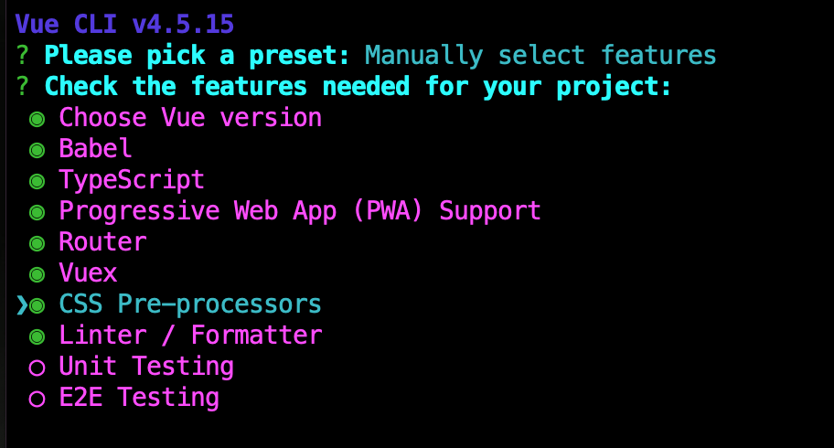
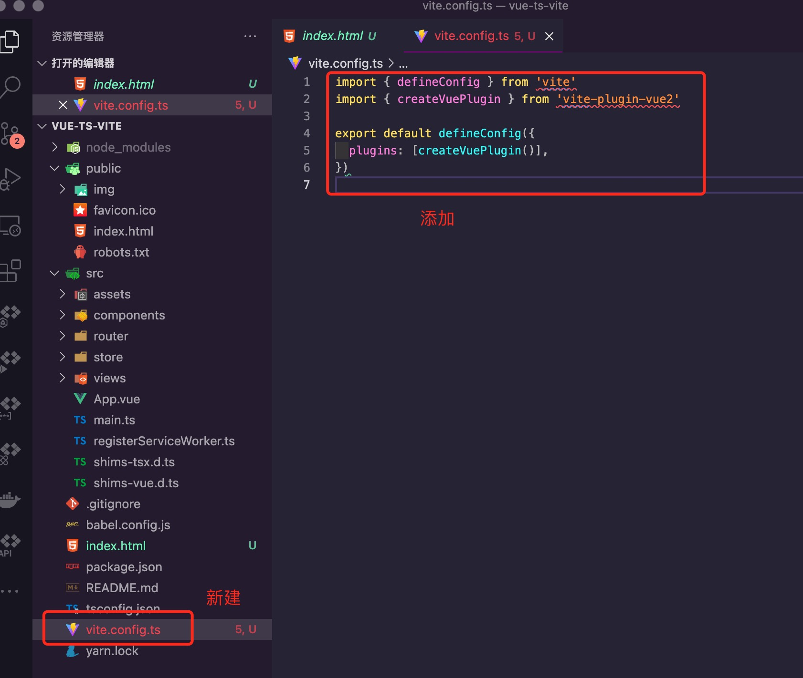
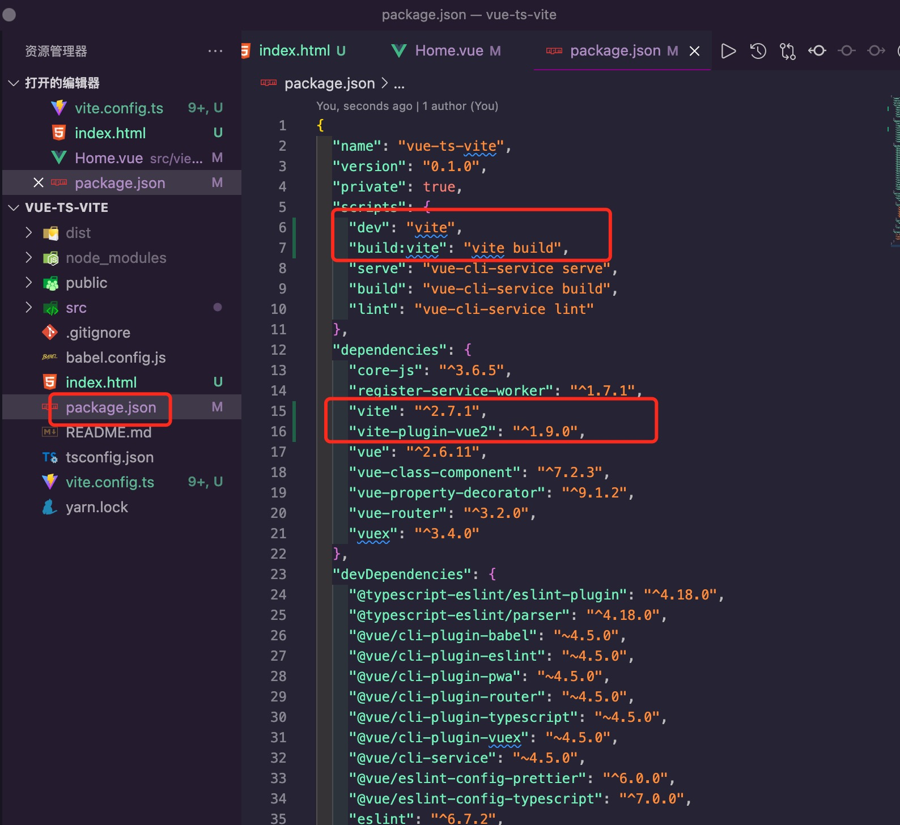
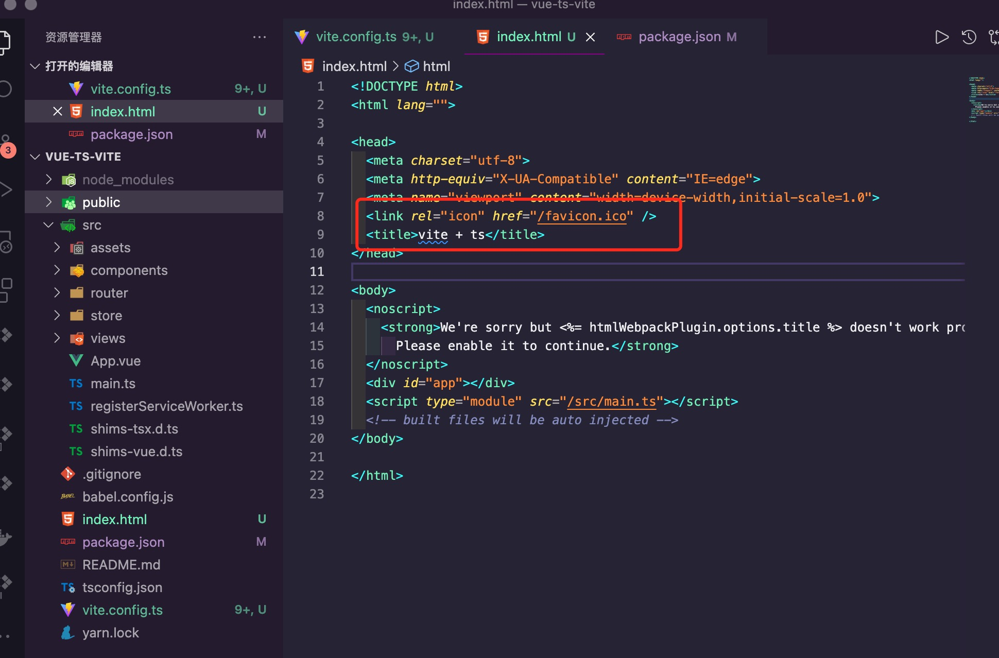
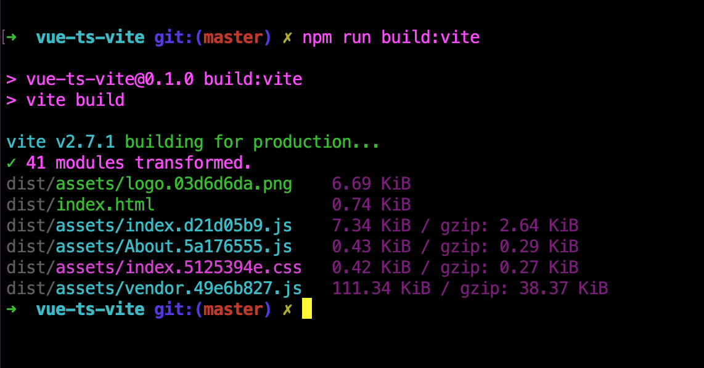

<Boxx  changeTime="5000"/>  

## 总方针：是什么？从哪里来？要到哪里去？

[ 注意: 下面的说明仅供参考,会由于项目变更而发生变化,请随时保持沟通! ]()

[gitlab - 源码](https://github.com/liugangtaotie/vite-principle-code)

### 一、是什么

有关vite是什么，请移步我的另一篇文章  [vite](/word/vite.html)；

### 推荐的官方文档

- [基于vue-cli4.0 + ts +ssr](https://segmentfault.com/a/1190000022616414)
